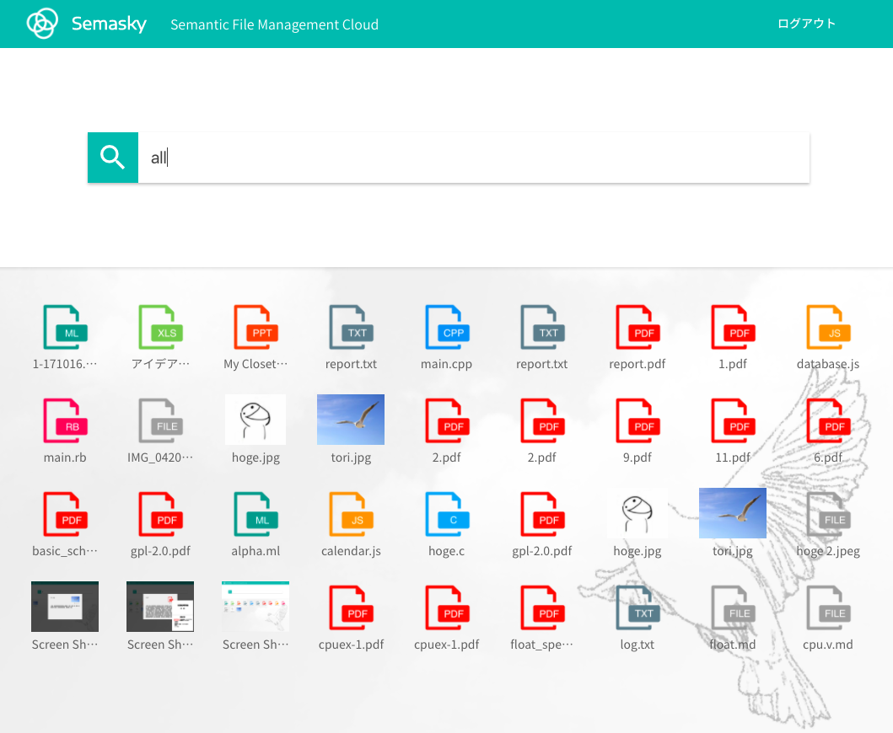

# Semasky - Cloud File Management System

You can try this here!: http://semasky.com/

<!-- START doctoc generated TOC please keep comment here to allow auto update -->
<!-- DON'T EDIT THIS SECTION, INSTEAD RE-RUN doctoc TO UPDATE -->


- [製品概要](#%E8%A3%BD%E5%93%81%E6%A6%82%E8%A6%81)
  - [File management x Cloud x Tech](#file-management-x-cloud-x-tech)
  - [背景](#%E8%83%8C%E6%99%AF)
  - [製品説明](#%E8%A3%BD%E5%93%81%E8%AA%AC%E6%98%8E)
  - [特長](#%E7%89%B9%E9%95%B7)
    - [1. 特長1](#1-%E7%89%B9%E9%95%B71)
    - [2. 特長2](#2-%E7%89%B9%E9%95%B72)
    - [3. 特長3](#3-%E7%89%B9%E9%95%B73)
  - [解決出来ること](#%E8%A7%A3%E6%B1%BA%E5%87%BA%E6%9D%A5%E3%82%8B%E3%81%93%E3%81%A8)
  - [今後の展望](#%E4%BB%8A%E5%BE%8C%E3%81%AE%E5%B1%95%E6%9C%9B)
- [開発内容・開発技術](#%E9%96%8B%E7%99%BA%E5%86%85%E5%AE%B9%E3%83%BB%E9%96%8B%E7%99%BA%E6%8A%80%E8%A1%93)
  - [活用した技術](#%E6%B4%BB%E7%94%A8%E3%81%97%E3%81%9F%E6%8A%80%E8%A1%93)
    - [API・データ](#api%E3%83%BB%E3%83%87%E3%83%BC%E3%82%BF)
    - [フレームワーク・ライブラリ・モジュール](#%E3%83%95%E3%83%AC%E3%83%BC%E3%83%A0%E3%83%AF%E3%83%BC%E3%82%AF%E3%83%BB%E3%83%A9%E3%82%A4%E3%83%96%E3%83%A9%E3%83%AA%E3%83%BB%E3%83%A2%E3%82%B8%E3%83%A5%E3%83%BC%E3%83%AB)
  - [独自開発技術（Hack Dayで開発したもの）](#%E7%8B%AC%E8%87%AA%E9%96%8B%E7%99%BA%E6%8A%80%E8%A1%93hack-day%E3%81%A7%E9%96%8B%E7%99%BA%E3%81%97%E3%81%9F%E3%82%82%E3%81%AE)
- [How to Run](#how-to-run)
  - [Requirements](#requirements)
  - [Setup](#setup)
  - [Run](#run)
  - [Build](#build)

<!-- END doctoc generated TOC please keep comment here to allow auto update -->

[](https://youtu.be/_hZz8RE6xkE)

## 製品概要
### File management x Cloud x Tech

### 背景
* 広く使われているファイル管理システムの木構造はプログラムにとっては効率的だが設計時に人間が使うことは想定されていなかった。(プログラムが自動でファイルを読むときには場所が一意に決まるから木構造は非常に便利)


* この構造は人間にとって非直感的なシステムであり、現状はマシン向けに作られたものを人間が無理やり使っている状態。


* 人間はファイルの"場所"ではなく、ファイルの中身の"意味"によってファイルを識別しているので、直感的にファイルを意味によって管理できるクラウドシステムを提案する。


### 製品説明
* 1から十数名くらいまでのグループに使われることを想定している。
* 管理したいファイルをドラッグ&ドロップでクラウドにあげ、直感的な検索によって簡単に目的のファイルを見つけることができる。
* ファイルに対するイメージだけ持って入れば発掘できる

### 特長

#### 1. 特長1
* ファイルの意味(Semantics)で検索できる


#### 2. 特長2
* ファイルのタグ付けの自動化


#### 3. 特長3
* 類似語検索ができる

### 解決出来ること
* ビジネスマンの労働時間の1割以上はファイルの検索に当てられていると言われており、その時間を短縮することで労働生産性をあげることができる。

### 今後の展望
* 提案するタグの改善
* OSとのインタフェースを作り、マウントできるようにする

## 開発内容・開発技術
### 活用した技術
#### API・データ
* キーワード抽出API gooラボ様
* 語句類似度算出API gooラボ様
* AWSインスタンス Amazon AWS様
* IBM image classifier IBM様

#### フレームワーク・ライブラリ・モジュール
* Sinatra
* Angular

#### デバイス
* 各自のPCのみ

### 研究内容・事前開発プロダクト
* なし、企画から実装まで全て二日間でやりました。

### 独自開発技術（Hack Dayで開発したもの）
* ファイルのタグ付けの自動化
* RDBを用いたファイル、タグの管理
* ドラッグ&ドロップでファイルをアップロード
* Base64 encodingによるファイルのアップロードシステム
* 一括アップロード
* 拡張子に応じたサムネイルを表示
* 画像はプレビューを表示
* ログインシステムの開発
* 本番環境へのデプロイ

## How to Run

### Requirements
* node v7.5.0 or later
* npm v4.6.1 or later
* ruby v2.3 or later

### Setup
```
$ cd back
$ gem install bundle
$ bundle install 
$ RACK_ENV=production bundle exec rake db:migrate
$ cd -

$ cd semasky
$ npm i
```

### Run
```
$ cd back
$ RACK_ENV=production bundle exec rackup -D
$ cd -

$ cd semasky
$ ng s
```

### Build
```
$ ng build
$ ng build --prod  // for production
```

* This project was generated with [Angular CLI](https://github.com/angular/angular-cli) version 1.0.0.
* This project is using goo API


